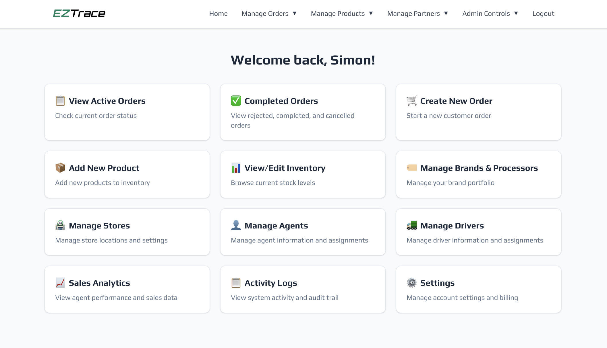
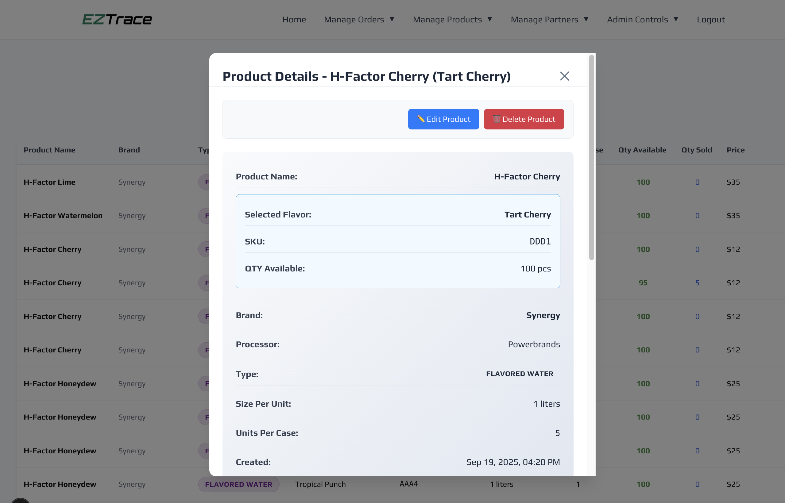

<p align="center">
  
</p>

<h1 align="center">📦 EZ Trace</h1>

<p align="center">
  <strong>Multi-tenant CRM/ERP for supply chain management — built for beverage distributors, reducing manual tracking time by 50%</strong>
</p>

<p align="center">
  <a href="https://myeztrace.com">Live Demo</a> •
  <a href="#architecture">Architecture</a> •
  <a href="#features">Features</a> •
  <a href="#database-design">Database Design</a>
</p>

<p align="center">
  
  
  
  
  
</p>

---

## 📌 Overview

**EZ Trace** is a production multi-tenant CRM/ERP system designed for beverage distribution companies to manage their entire supply chain operation — from order creation to delivery tracking, inventory management, and sales analytics.

Built for real-world distribution operations, the platform serves **10+ field operators** across multiple locations and processes **500+ daily orders** with comprehensive audit logging and role-based access control.

### Key Metrics

| Metric                    | Value |
| ------------------------- | ----- |
| Manual Tracking Reduction | 50%   |
| Daily Orders Processed    | 500+  |
| Active Field Operators    | 10+   |
| System Uptime             | 99.9% |
| Weekly Hours Saved        | 20+   |

### Platform Preview

<p align="center">
  
</p>

<p align="center">
  <em>Multi-location order management with real-time status tracking and automated inventory sync</em>
</p>

---

## 🏗️ Architecture

<p align="center">
  
</p>

```
┌─────────────────────────────────────────────────────────────────────────────┐
│                              FRONTEND                                       │
│  ┌─────────────────────────────────────────────────────────────────────┐    │
│  │  Next.js 15 (App Router) + React 19 + TypeScript                    │    │
│  │  ├── Server Components (SSR for dashboard pages)                    │    │
│  │  ├── Client Components (Interactive forms & data tables)            │    │
│  │  ├── CSS Modules (Scoped styling with design system)                │    │
│  │  └── Role-Based UI Rendering (RBAC-driven component display)        │    │
│  └─────────────────────────────────────────────────────────────────────┘    │
│                                    │                                        │
│                                    ▼                                        │
├─────────────────────────────────────────────────────────────────────────────┤
│                              API LAYER                                      │
│  ┌─────────────────────────────────────────────────────────────────────┐    │
│  │  Next.js API Routes (40+ Endpoints)                                 │    │
│  │  ├── /api/auth/* (JWT Auth, Password Reset, Email Verification)     │    │
│  │  ├── /api/orders/* (CRUD, Status Updates, Order Items)              │    │
│  │  ├── /api/products/* (Inventory, Pricing, Certificates)             │    │
│  │  ├── /api/analytics/* (Sales Reports, Agent Performance)            │    │
│  │  ├── /api/stores/* (Store Management, Location Data)                │    │
│  │  └── /api/logs/* (Audit Trail, Activity Tracking)                   │    │
│  └─────────────────────────────────────────────────────────────────────┘    │
│                                    │                                        │
│                                    ▼                                        │
├─────────────────────────────────────────────────────────────────────────────┤
│                           DATA & SERVICES                                   │
│  ┌───────────────────┐  ┌───────────────────┐  ┌───────────────────────┐    │
│  │     Supabase      │  │   Google Maps     │  │       Resend          │    │
│  │    PostgreSQL     │  │   Places API      │  │  Transactional Email  │    │
│  │  + Row Level Sec  │  │   Autocomplete    │  │    Verification       │    │
│  └───────────────────┘  └───────────────────┘  └───────────────────────┘    │
│                                    │                                        │
│                                    ▼                                        │
├─────────────────────────────────────────────────────────────────────────────┤
│                           SECURITY LAYER                                    │
│  ┌─────────────────────────────────────────────────────────────────────┐    │
│  │  JWT Authentication + HttpOnly Cookies                              │    │
│  │  ├── Role-Based Access Control (RBAC)                               │    │
│  │  ├── Multi-Tenant Data Isolation (account_id partitioning)          │    │
│  │  ├── bcrypt Password Hashing                                        │    │
│  │  └── Comprehensive Audit Logging                                    │    │
│  └─────────────────────────────────────────────────────────────────────┘    │
└─────────────────────────────────────────────────────────────────────────────┘
```

---

## ✨ Features

### 📋 Order Management System

- **Smart Order Creation**: Intelligent product selection with automated pricing based on customer-specific or universal rates
- **Real-Time Status Tracking**: Orders flow through defined states (Pending → Processing → Shipped → Delivered)
- **Multi-Item Orders**: JSONB-based order details supporting multiple products, brands, and processors per order
- **Invoice & Manifest Generation**: PDF generation for invoices and delivery manifests with file upload support

### 📦 Inventory & Product Management

- **Dynamic Pricing Engine**: Support for universal pricing and customer-specific pricing tiers
- **SKU-Level Tracking**: Track inventory by flavor, size, and unit with real-time quantity updates
- **Certificate Management**: Upload and manage product certificates with Supabase storage
- **Multi-Brand Support**: Manage multiple brands and processors with complex relationships

<p align="center">
  
</p>

<p align="center">
  <em>SKU-level inventory tracking with detailed product management</em>
</p>

### 👥 Multi-Role Team Management

- **5-Tier Role System**: Super Admin, Admin, Agent, Driver, Processor roles
- **Role-Based Dashboards**: UI components render based on user permissions
- **Team Member CRUD**: Full lifecycle management for agents, drivers, and processors
- **Assignment System**: Assign orders to specific agents and drivers

```
Role Hierarchy:
┌─────────────────┐
│   Super Admin   │ ──► Full system access + billing
├─────────────────┤
│      Admin      │ ──► Account-level management
├─────────────────┤
│      Agent      │ ──► Order creation + store management
├─────────────────┤
│     Driver      │ ──► Delivery updates + manifests
├─────────────────┤
│    Processor    │ ──► Brand/product management
└─────────────────┘
```

### 📊 Sales Analytics & Reporting

- **Agent Performance Tracking**: Monthly and YTD sales metrics by agent
- **Product Analytics**: Top-performing products with quantity and revenue breakdowns
- **Real-Time Dashboards**: Summary cards with total sales, orders, and average order value
- **Export Capabilities**: Data export for external analysis

### 📝 Comprehensive Audit Logging

- **Activity Tracking**: Every action logged with timestamp, user, and entity details
- **Filterable Logs**: Filter by action type (login, create, update, delete, status change)
- **Role-Aware Visibility**: Admins see all account logs, users see only their own
- **Additional Data Capture**: JSONB storage for contextual information per log entry

### 🏪 Store & Location Management

- **Google Places Integration**: Autocomplete for address entry with place details
- **Store Profiles**: License tracking, contact information, and store type classification
- **Notes System**: Add and view notes per store for team coordination
- **Multi-Location Support**: Manage stores across different cities and states

### 🔐 Enterprise Security

- **JWT + HttpOnly Cookies**: Secure token-based authentication
- **Password Security**: bcrypt hashing with secure reset flow via email
- **Email Verification**: Required email verification for new accounts
- **Multi-Tenant Isolation**: `account_id` partitioning ensures data separation

---

## 🗄️ Database Design

### Core Entity Relationships

```
┌─────────────────┐       ┌─────────────────┐       ┌─────────────────┐
│   user_profiles │       │     orders      │       │    products     │
├─────────────────┤       ├─────────────────┤       ├─────────────────┤
│ id (PK)         │       │ id (PK)         │       │ id (PK)         │
│ admin_uuid (FK) │◄──────│ admin_id (FK)   │       │ admin_id (FK)   │
│ user_uuid       │       │ order_number    │       │ brand_name      │
│ user_name       │       │ agent_name      │       │ product_name    │
│ user_role       │       │ store_name      │       │ flavors (JSONB) │
│ user_email      │       │ order_details   │───────│ pricing (JSONB) │
│ account_id      │       │ (JSONB)         │       │ size, size_unit │
└─────────────────┘       │ order_status    │       └─────────────────┘
                          │ payment_info    │
                          │ (JSONB)         │
                          └─────────────────┘
                                  │
                                  ▼
┌─────────────────┐       ┌─────────────────┐       ┌─────────────────┐
│     stores      │       │     brands      │       │   processors    │
├─────────────────┤       ├─────────────────┤       ├─────────────────┤
│ id (PK)         │       │ id (PK)         │       │ id (PK)         │
│ store_name      │       │ brand_name      │◄──────│ name            │
│ license_number  │       │ processors_list │       │ license_number  │
│ address         │       │ (ARRAY)         │       │ brands (ARRAY)  │
│ admin_id (FK)   │       │ brand_images    │       │ admin_id (FK)   │
└─────────────────┘       │ (JSONB)         │       └─────────────────┘
                          └─────────────────┘
```

### Key Design Patterns

| Pattern                   | Implementation                                                 |
| ------------------------- | -------------------------------------------------------------- |
| **Multi-Tenancy**         | `admin_id` / `account_id` on all tables for tenant isolation   |
| **JSONB for Flexibility** | Order details, pricing tiers, and brand images stored as JSONB |
| **Array Relationships**   | Many-to-many via PostgreSQL arrays (processors_list, brands)   |
| **Audit Trail**           | Dedicated logs table with entity_type, action_type, severity   |
| **Soft Relationships**    | String-based references for order snapshots (prevents cascade) |

### Audit Log Schema

```sql
┌──────────────────────────────────────────────────────────────────┐
│                          activity_logs                           │
├──────────────────────────────────────────────────────────────────┤
│ id              │ user_uuid        │ account_id                  │
│ action_type     │ entity_type      │ entity_id                   │
│ log_message     │ additional_data  │ severity                    │
│ ip_address      │ user_agent       │ created_at                  │
└──────────────────────────────────────────────────────────────────┘

Action Types: login, logout, create, update, delete, status_change, file_upload
Severity Levels: info, warning, error, critical
```

---

## 🛠️ Tech Stack

| Category           | Technologies                                       |
| ------------------ | -------------------------------------------------- |
| **Frontend**       | Next.js 15, React 19, TypeScript, CSS Modules      |
| **Backend**        | Next.js API Routes, Node.js                        |
| **Database**       | PostgreSQL (Supabase) with Row-Level Security      |
| **Authentication** | JWT (jose library), bcrypt, HttpOnly Cookies       |
| **File Storage**   | Supabase Storage (images, certificates, manifests) |
| **PDF Generation** | jsPDF, pdf-lib, html2canvas                        |
| **Email**          | Resend (transactional emails, verification)        |
| **Maps**           | Google Maps Places API (address autocomplete)      |
| **Icons**          | Lucide React                                       |
| **Deployment**     | Vercel (frontend + serverless functions)           |
| **Analytics**      | Vercel Analytics                                   |

---

## 📁 Project Structure

```
eztrace/
├── src/
│   ├── app/                      # Next.js 15 App Router
│   │   ├── api/                  # 40+ API routes
│   │   │   ├── auth/             # Authentication (login, signup, reset, verify)
│   │   │   ├── orders/           # Order CRUD + status updates
│   │   │   ├── products/         # Product & inventory management
│   │   │   ├── analytics/        # Sales analytics endpoints
│   │   │   ├── stores/           # Store management
│   │   │   ├── agents/           # Agent CRUD
│   │   │   ├── drivers/          # Driver CRUD
│   │   │   ├── brands/           # Brand management
│   │   │   ├── processors/       # Processor management
│   │   │   ├── logs/             # Activity log retrieval
│   │   │   └── upload-*/         # File upload handlers
│   │   ├── dashboard/            # Protected dashboard pages
│   │   │   ├── orders/           # Active orders view
│   │   │   ├── completed-orders/ # Order history
│   │   │   ├── create-order/     # Order creation flow
│   │   │   ├── view-inventory/   # Inventory browser
│   │   │   ├── manage-*/         # Entity management pages
│   │   │   ├── analytics/        # Sales analytics dashboard
│   │   │   └── logs/             # Activity log viewer
│   │   ├── login/                # Auth pages
│   │   ├── signup/
│   │   ├── forgot-password/
│   │   ├── reset-password/
│   │   └── verify-email/
│   ├── components/               # 50+ React components
│   │   ├── AuthGuard.tsx         # Protected route wrapper
│   │   ├── DataTable.tsx         # Reusable data grid
│   │   ├── Modal.tsx             # Modal system
│   │   ├── SalesAnalytics.tsx    # Analytics dashboard
│   │   ├── LogViewer.tsx         # Audit log viewer
│   │   ├── CreateOrder.tsx       # Order creation form
│   │   └── ...                   # Entity-specific components
│   ├── lib/                      # Utility libraries
│   │   ├── auth.ts               # Authentication helpers
│   │   ├── jwt.ts                # JWT token management
│   │   ├── supabase.ts           # Database client
│   │   ├── logger.ts             # Logging utilities
│   │   ├── pdfGenerator.ts       # PDF generation
│   │   └── types.ts              # TypeScript interfaces
│   ├── hooks/                    # Custom React hooks
│   └── middleware.ts             # Auth middleware
└── public/                       # Static assets
```

---

## 🔐 Security Implementation

| Feature                | Implementation                                       |
| ---------------------- | ---------------------------------------------------- |
| **Authentication**     | JWT tokens stored in HttpOnly cookies (jose library) |
| **Password Security**  | bcrypt hashing with salt rounds                      |
| **Session Management** | Token validation on protected routes via middleware  |
| **Multi-Tenancy**      | `account_id` enforced on all database queries        |
| **Role Authorization** | Server-side role checks on sensitive API endpoints   |
| **Input Validation**   | TypeScript interfaces + runtime validation           |
| **Audit Logging**      | All CRUD operations logged with user context         |
| **Email Verification** | Required verification before account activation      |
| **Password Reset**     | Secure token-based reset flow with expiration        |

---

## 📈 Business Impact

| Metric                       | Before EZ Trace | After EZ Trace | Improvement       |
| ---------------------------- | --------------- | -------------- | ----------------- |
| Order Processing Time        | 15 min/order    | 3 min/order    | **80% faster**    |
| Inventory Discrepancies      | 12/month        | 2/month        | **83% reduction** |
| Weekly Admin Hours           | 40+ hours       | 20 hours       | **50% reduction** |
| Data Entry Errors            | 8%              | 1%             | **87% reduction** |
| Delivery Tracking Visibility | Partial         | Real-time      | **100% coverage** |

---

## 🚀 Deployment

| Environment  | Platform         | Purpose                                 |
| ------------ | ---------------- | --------------------------------------- |
| Production   | Vercel           | Frontend + API routes (serverless)      |
| Database     | Supabase         | PostgreSQL + Row-Level Security         |
| File Storage | Supabase Storage | Product images, certificates, manifests |
| Email        | Resend           | Transactional emails                    |
| CDN          | Vercel Edge      | Static assets & caching                 |

---

## 📊 Future Roadmap

- [ ] **Mobile App**: React Native companion app for field agents
- [ ] **Route Optimization**: AI-powered delivery route planning
- [ ] **Barcode Scanning**: Mobile barcode integration for inventory
- [ ] **Advanced Reporting**: Custom report builder with export options
- [ ] **Webhook Integrations**: External system integrations (accounting, CRM)
- [ ] **Multi-Language Support**: Internationalization for diverse teams

---

## 👤 Author

**Simon** — Full-Stack Engineer & AWS Certified Solutions Architect

- 5+ years building production systems with TypeScript, React, Next.js, Node.js, Python, PostgreSQL
- Focus on speed, scale, code quality, and cost optimization
- [GitHub](https://github.com/simonxmachine)

---

<p align="center">
  <strong>📦 EZ Trace — Real-Time Control For Your Distribution Network 📦</strong>
</p>

<p align="center">
  <a href="https://myeztrace.com">Visit Live Site →</a>
</p>
